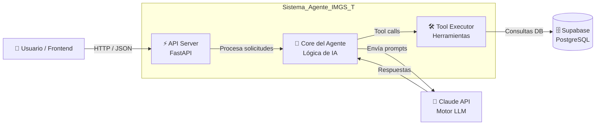

# 🤖 Agente IMGS-T  
### Consultor de Sostenibilidad Textil basado en IA

---

## 📌 Descripción

Este proyecto consiste en el desarrollo de un chatbot inteligente, capaz de generar respuestas en tiempo real a partir de las consultas realizadas por las empresas.

El sistema permite analizar y validar los resultados de la prueba IMGS-T, así como responder dudas relacionadas con las recomendaciones obtenidas, con el fin de apoyar la toma de decisiones y la mejora de la sostenibilidad en el sector textil.


El sistema implementa una **arquitectura cliente-servidor**, donde:

- El backend procesa las solicitudes
- Consulta la base de datos
- Se comunica con un modelo de IA para generar respuestas dinámicas

El objetivo es proveer un **agente de consultoría en sostenibilidad** dirigido a **PyMEs textiles colombianas**, permitiendo evaluar su nivel de madurez y generar planes de acción personalizados.

---

## 🧠 Tecnologías utilizadas

- **FastAPI** → Backend y endpoints REST  
- **Anthropic (Claude)** → Motor de inteligencia artificial  
- **Supabase (PostgreSQL)** → Base de datos  
- **Python** → Lógica del sistema  

---

## 🏗️ Arquitectura (C4 Model)

A continuación se presenta el diagrama general de la arquitectura utilizando el estándar **C4 (Nivel de Contenedores)**:



### Explicacion del diagrama

El usuario interactúa a través de una interfaz de chat, enviando consultas que son procesadas por una API desarrollada en FastAPI. Esta API se encarga de recibir y validar las solicitudes, y luego las envía al núcleo del agente.

El Core del Agente gestiona la lógica de inteligencia artificial, construyendo los prompts y comunicándose con el modelo de lenguaje (Claude), que genera las respuestas.

Si la consulta requiere información adicional, se utilizan herramientas internas (Tool Executor) que permiten consultar o guardar datos en la base de datos (Supabase).

Finalmente, la respuesta generada se devuelve al usuario en tiempo real.

---

### 📁 Estructura del Proyecto

```
Chatbot/
│
├── agente-imgs-t/
│   ├── agent/
│   │   ├── __init__.py
│   │   ├── agent.py              # Lógica principal del agente (IA)
│   │   ├── prompts.py            # Definición de prompts para el modelo
│   │   ├── tool_executor.py      # Ejecución de herramientas (tool calls)
│   │   └── tools.py              # Funciones disponibles para el agente
│   │
│   ├── db/                       # Conexión y lógica de base de datos
│   ├── knowledge/                # Base de conocimiento (recomendaciones)
│   │
│   ├── chat.html                 # Interfaz básica de chat
│   ├── main.py                   # Punto de entrada (API con FastAPI)
│   │
│   ├── test_db_empresa.py        # Pruebas de base de datos
│   ├── verificar_modelos.py      # Validación de modelos de IA
│   │
│   ├── requirements.txt          # Dependencias del proyecto
│   ├── .env                      # Variables de entorno (NO subir a GitHub)
│   ├── .gitignore                # Archivos ignorados por Git
│   │
│   ├── README.md                 # Documentación del proyecto
│   └── venv/                  
```

---

### Componentes Principales

1. **API Server (FastAPI)**: El punto de entrada (`main.py`). Se encarga de procesar las URLs web, validar esquemas con Pydantic, servir la UI basica `chat.html` y manejar excepciones.
2. **Core del Agente (agent.py)**: Orquesta la interacción con Anthropic. Implementa un bucle donde le envía el historial a Claude. Si Claude emite intenciones de invocar herramientas ("tool_use"), se procesan internamente.
3. **Tool Executor (tool_executor.py)**: Cuando Claude decide que necesita datos adicionales (como las preguntas respondidas y resultados del usuario), delega a este módulo para obtenerlos o guardarlos.
4. **Supabase Client**: Se usa para comunicarse a la capa de persistencia remota (Postgres), consultar el estado de la empresa y poder generar los planes de acción a la medida.
5. **Base de Conocimiento (knowledge/)**: Una base documental interna estandarizada (`recomendaciones.py`) que las herramientas consultan (ej. `_buscar_recomendaciones`).

## Uso Local

1. Instalar requerimientos: `pip install -r requirements.txt`
2. Configurar variables en un `.env` (como las claves de SUPABASE y ANTHROPIC_API_KEY).
3. Iniciar servidor: `python main.py` o mediante uvicorn estándar.
