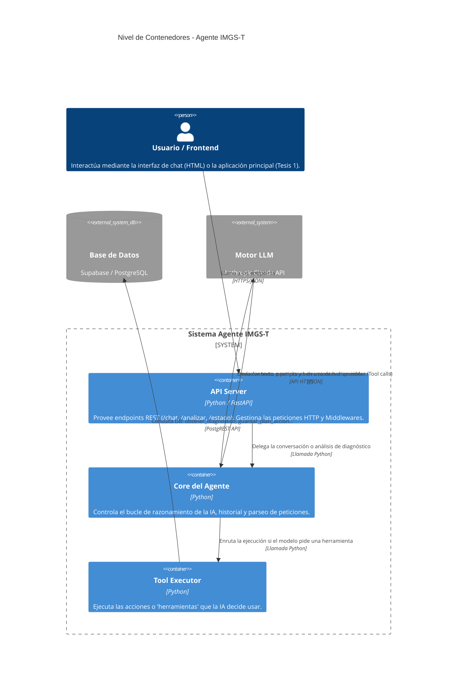

# Agente IMGS-T - Consultor de Sostenibilidad Textil

Este proyecto provee un agente de IA para consultoría en sostenibilidad dirigido a PyMEs textiles colombianas. Utiliza FastAPI para los endpoints de la API, integra a Anthropic (Claude) como motor LLM central, y utiliza Supabase como base de datos para almacenar el contexto y los resultados de los diagnósticos.

## Arquitectura (C4 Model)

A continuación se presenta el diagrama general de la arquitectura utilizando el estándar C4 (Nivel de Contenedores).

### Componentes Principales

1. **API Server (FastAPI)**: El punto de entrada (`main.py`). Se encarga de procesar las URLs web, validar esquemas con Pydantic, servir la UI basica `chat.html` y manejar excepciones.
2. **Core del Agente (agent.py)**: Orquesta la interacción con Anthropic. Implementa un bucle donde le envía el historial a Claude. Si Claude emite intenciones de invocar herramientas ("tool_use"), se procesan internamente.
3. **Tool Executor (tool_executor.py)**: Cuando Claude decide que necesita datos adicionales (como las preguntas respondidas y resultados del usuario), delega a este módulo para obtenerlos o guardarlos.
4. **Supabase Client**: Se usa para comunicarse a la capa de persistencia remota (Postgres), consultar el estado de la empresa y poder generar los planes de acción a la medida.
5. **Base de Conocimiento (knowledge/)**: Una base documental interna estandarizada (`recomendaciones.py`) que las herramientas consultan (ej. `_buscar_recomendaciones`).

## Uso Local

1. Instalar requerimientos: `pip install -r requirements.txt`
2. Configurar variables en un `.env` (como las claves de SUPABASE y ANTHROPIC_API_KEY).
3. Iniciar servidor: `python main.py` o mediante uvicorn estándar.
